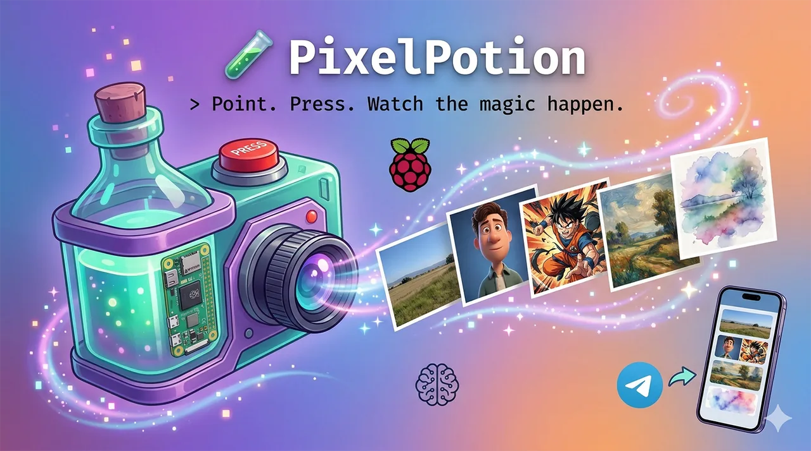
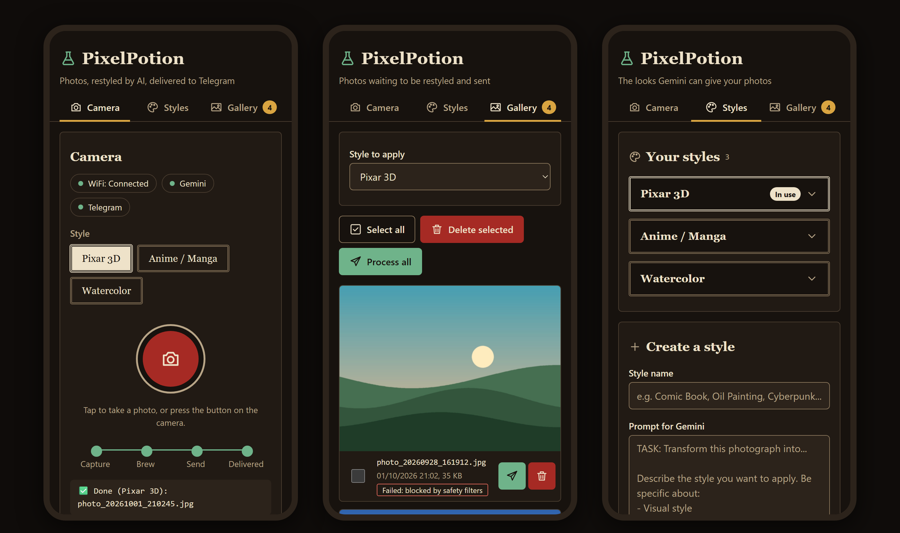
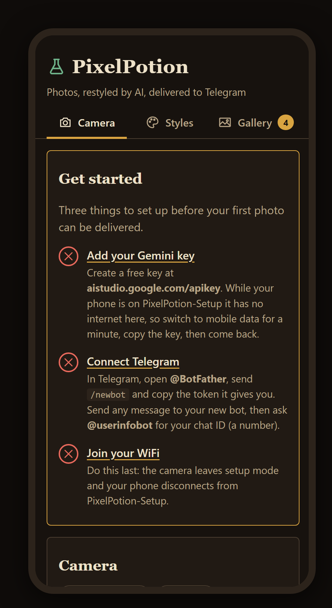

<div align="center">

# PixelPotion



[](LICENSE)
[](https://www.python.org/)
[](https://www.raspberrypi.com/)
[](https://aistudio.google.com/)

</div>

PixelPotion is a small camera you build from a Raspberry Pi. Press its button and it takes a
photo, asks Google Gemini to repaint it in a style you picked (Pixar-like 3D, anime,
watercolor, or one you write yourself), and sends both the original and the new picture to
your Telegram chat.

You set it up and use it from a web page on your phone. No app to install.

## Contents

- [What it looks like](#what-it-looks-like)
- [How it works](#how-it-works)
- [What you need](#what-you-need)
- [Wiring](#wiring)
- [First setup](#first-setup)
- [Everyday use](#everyday-use)
- [Updating](#updating)
- [Uninstalling](#uninstalling)
- [Privacy and costs](#privacy-and-costs)
- [Troubleshooting](#troubleshooting)
- [Development](#development)

## What it looks like



*Camera, Gallery and Styles pages. Screenshots come from a local demo with placeholder
photos, not from a real camera.*

## How it works

1. **You take a photo**, with the button on the camera or the big round button in the web
   page.
2. **The photo is saved to a queue** on the camera's SD card before anything else happens.
3. **Gemini restyles it** with the style you chose.
4. **Telegram delivers it**: first the original, then the styled version.
5. **The photo leaves the queue** only after both Telegram messages went through.

If the camera has no internet, the photo waits in the queue. Every 5 minutes the camera
retries waiting photos on its own. If Gemini refuses a photo for good (for example, a
rejected API key or a safety filter), the photo stays in the **Gallery** marked
`Failed: <reason>` until you retry or delete it.

## What you need

| Part | Notes |
| --- | --- |
| Raspberry Pi Zero 2 W | The computer inside the camera. |
| Camera Module 3 (IMX708) or Camera Module 2.1 (IMX219) | Either works. You pick which one in the portal. |
| Camera cable for the Pi Zero | The Zero uses a **narrower** connector than full-size Pis. Check the cable fits both ends. |
| Momentary push button + 2 jumper wires | The shutter button. |
| 5 V 2.5 A micro-USB power supply | A weak supply causes random restarts. |
| microSD card, 16 GB or more | Holds the operating system and your photos. |

You also need a Google account (for the Gemini API key) and a Telegram account.

## Wiring

**Power the Pi off before connecting anything.**

### Camera

1. Gently pull out the dark latch of the camera connector on the Pi Zero 2 W.
2. Slide the camera cable in, with the metal contacts facing the board.
3. Push the latch back in. The cable should not come out with a light tug.

### Button

Connect one leg of the button to **pin 11 (GPIO17)** and the other leg to **pin 9 (GND)**.
No resistor is needed: the software turns on the Pi's internal pull-up.

```text
   Pi Zero 2 W GPIO header (first rows)

          3.3V   pin 1  o o  pin 2   5V
         GPIO2   pin 3  o o  pin 4   5V
         GPIO3   pin 5  o o  pin 6   GND
         GPIO4   pin 7  o o  pin 8   GPIO14
   +----- GND    pin 9  o o  pin 10  GPIO15
   | +-- GPIO17  pin 11 o o  pin 12  GPIO18
   | |                  ...
   | |
   | +---[ BUTTON ]---+
   +------------------+
```

Pin 1 is at the end of the header nearest the SD card slot and has a square solder pad. Presses less than 2 seconds apart count as one.

## First setup

Plan for about an hour the first time, most of it waiting for downloads.

### 1. Prepare the SD card

1. Install [Raspberry Pi Imager](https://www.raspberrypi.com/software/) on your computer.
2. Choose **Raspberry Pi OS Lite (64-bit)**.
3. Open the settings (the gear icon, or "Edit settings") and set:
   - Hostname: `pixelpotion`
   - Username: **`pi`** and a password you will remember
   - WiFi: your home network (only needed to download PixelPotion during setup)
   - Enable SSH
4. Write the card, put it in the Pi and power it on. Wait about 2 minutes.

> **The username must be `pi`.** This is a known limitation: the installer and the service
> expect `/home/pi`. Recent Raspberry Pi OS images no longer create a `pi` user unless you
> ask for it, and `install.sh` stops with an error if it is missing.

### 2. Install PixelPotion

From your computer, open a terminal and log in to the Pi:

```bash
ssh pi@pixelpotion.local
```

Then, on the Pi:

```bash
git clone https://github.com/nikolmedo/PixelPotion /home/pi/pixelpotion-install
cd /home/pi/pixelpotion-install
sudo bash install.sh
```

If `git` is missing, install it first with `sudo apt-get install -y git`.

The installer:

- installs the camera, button and WiFi hotspot packages (`hostapd`, `dnsmasq`),
- copies the app to `/home/pi/pixelpotion` with its own Python environment,
- creates the `PixelPotion-Setup` hotspot with a **random password for this device**,
- sets up the `pixelpotion` service so the camera starts on every boot.

At the end it prints the hotspot password. **Write it down.** Then restart:

```bash
sudo reboot
```

### 3. Join the setup network

After the reboot the camera creates its own WiFi network:

| | |
| --- | --- |
| Network name | `PixelPotion-Setup` |
| Password | the one `install.sh` printed |

Connect your phone to it and open **<http://192.168.4.1:8080>**.

### 4. Follow "Get started"

The first page shows a **Get started** checklist, and each step links to the **Settings**
tab, where all the forms live. Do the steps in this order.



**Gemini key.** Go to [aistudio.google.com/apikey](https://aistudio.google.com/apikey),
create a key and copy it. The setup network has no internet, so switch your phone to mobile
data for a minute to do this, then come back. Paste the key under **AI and Telegram** on the
**Settings** tab and save.

**Telegram.**

1. In Telegram, open **@BotFather**, send `/newbot`, and follow the questions. Copy the token
   it gives you (it looks like `123456789:ABCdef...`) into **Bot token**.
2. Open your new bot and send it any message. A bot cannot write to you until you write to it
   first.
3. Send any message to **@userinfobot**. It answers with your chat ID, a number. Put it in
   **Chat ID** and save.

For a group, add the bot to the group and use the group's chat ID (it starts with `-100`).

**WiFi, last.** On the **Settings** tab, under **WiFi**, tap **Find networks** or type your network name, enter the
password and tap **Connect to WiFi**. The camera leaves setup mode, so your phone drops off
`PixelPotion-Setup`. Reconnect your phone to your home WiFi and open
**<http://pixelpotion.local:8080>**. If that address does not load, look up the camera's IP
address in your router and open `http://<that address>:8080`.

If the camera cannot join your WiFi, `PixelPotion-Setup` comes back after about a minute so
you can try again.

## Everyday use

- **Take a photo:** press the button, or tap the round button on the **Camera** page. A
  progress line shows Capture, Brew (Gemini), Send and Delivered.
- **Pick a style:** tap a style on the Camera page. The button uses whichever style is
  selected.
- **Styles page:** edit the built-in styles or create your own. A style is a name plus a
  text prompt that tells Gemini what to do. Prompts that work well:
  - start with `TASK: Transform this photograph into...`,
  - ask for people to stay recognizable,
  - say what to do with indoor and outdoor backgrounds,
  - include `No text, watermarks, or logos`,
  - end with `OUTPUT: Generate the transformed image now.`
- **Gallery page:** every photo that has not been delivered yet.
  - `Not sent yet`: waiting for WiFi or for the next automatic retry.
  - `Failed: <reason>`: Gemini refused it for good. It is not retried automatically.
  - The send button processes one photo, **Process all** processes all of them (both clear
    the failed mark), and you can pick another style before sending. You can also delete
    photos one by one or in bulk.
- **Camera module:** on the **Settings** tab, under **AI and Telegram > Camera**, choose the module you installed.

## Updating

On the Pi:

```bash
sudo bash /home/pi/pixelpotion/update.sh
```

It checks GitHub for a newer release, backs up `config.json` to `config.json.bak`, replaces
the app files, reinstalls Python packages and restarts the service. Your settings and photos
are kept. Add `--force` to reinstall the latest release even if you already have it.

> **Installed v2.0.2 or earlier?** Those installs have no `update.sh` and run as root.
> Upgrade once by running the installer again from a fresh copy:
>
> ```bash
> git clone https://github.com/nikolmedo/PixelPotion /home/pi/pixelpotion-new
> cd /home/pi/pixelpotion-new
> sudo bash install.sh
> ```
>
> After that, `update.sh` works as described above.

See [CHANGELOG.md](CHANGELOG.md) for what changed in each version.

## Uninstalling

Which script you need depends on the version you installed. If
`/home/pi/pixelpotion/uninstall.sh` exists, you have v3.x.

**v3.x:**

```bash
sudo bash /home/pi/pixelpotion/uninstall.sh
```

**v2.0.2 or earlier:** those versions shipped no uninstaller. Download
`uninstall-legacy.sh` from this repository and run it:

```bash
curl -fsSLO https://raw.githubusercontent.com/nikolmedo/PixelPotion/main/uninstall-legacy.sh
sudo bash uninstall-legacy.sh
```

(Or `git clone https://github.com/nikolmedo/PixelPotion` and run it from the clone.)
Each script checks the install first and tells you to use the other one if you picked the
wrong one.

Both ask for confirmation, then:

- **Remove** the `pixelpotion` service, the `PixelPotion-Setup` hotspot settings (hostapd
  and dnsmasq files, and the hotspot block in `/etc/dhcpcd.conf`, saved first as
  `/etc/dhcpcd.conf.pixelpotion-uninstall-<date>`), the sudo rules (v3.x), the WiFi
  password copy in `/tmp` (v2.0.2 or earlier) and `/home/pi/pixelpotion`.
- **Keep your photos and settings.** `photos/` and `config.json` are moved to
  `/home/pi/pixelpotion-backup-<date>/`, readable only by the `pi` user, because
  `config.json` holds your API keys.
- **Keep** your home WiFi connection (`/etc/wpa_supplicant/wpa_supplicant.conf`), the apt
  packages and the camera settings in `/boot/firmware/config.txt`, unless you ask otherwise.

| Option | What it does |
|---|---|
| `--yes` | Do not ask for confirmation. |
| `--purge` | Delete photos and `config.json` instead of backing them up. |
| `--remove-packages` | Also remove the `hostapd` and `dnsmasq` packages. |
| `--restore-boot-config` | Remove the three camera lines the installer added to `/boot/firmware/config.txt`. Leave it off if other camera software uses the camera. |
| `--remove-pip-packages` | v2.0.2 or earlier only: uninstall `flask`, `requests`, `google-genai` and `Pillow` from the system Python. Other programs may need them. |
| `--force` | Run even if the script thinks you picked the wrong one. |

Running a script again is safe: it reports "Nothing to remove". Reboot afterwards
(`sudo reboot`) so the WiFi settings take effect.

## Privacy and costs

- **Your photos leave the camera.** Each photo is sent to Google's Gemini API to be restyled,
  and both versions are sent to Telegram. Their privacy terms apply.
- **Copies stay on the SD card.** Originals are kept in `photos/original/` and styled
  versions in `photos/processed/` inside `/home/pi/pixelpotion`. Nothing deletes them
  automatically. Only the queue copy is removed after delivery.
- **Keys stay on the device.** The Gemini key, Telegram token and WiFi password are stored in
  `/home/pi/pixelpotion/config.json`, readable only by the `pi` user. The portal never shows
  them again after you save them.
- **The portal has no login.** Anyone on the same network can open it, take photos, change
  settings and delete photos. Keep the camera on a network you trust, and do not expose port
  8080 to the internet.
- **Gemini may cost money.** Image generation can go beyond Google's free tier. Check
  [Gemini API pricing](https://ai.google.dev/gemini-api/docs/pricing) and your usage in Google AI
  Studio. A photo that already got its styled version is not sent to Gemini
  again when only the Telegram step is retried.

## Troubleshooting

### I can't see the `PixelPotion-Setup` network

- Wait a full minute after power-on.
- The hotspot only appears when the camera has no WiFi saved, or cannot join the saved one.
  If it already joined your home WiFi, open <http://pixelpotion.local:8080> from your home
  network instead.
- Reboot the Pi: `sudo reboot`.

### I lost the hotspot password

Log in over SSH (or with a keyboard and screen) and run:

```bash
sudo grep wpa_passphrase /etc/hostapd/hostapd.conf
```

That file is where the password lives. The first install also copies it into
`/home/pi/pixelpotion/config.json` as `ap_password`, but the camera does not read it from
there.

### A photo stays in the Gallery

- `Not sent yet` with no WiFi: it goes out by itself once the camera is online.
- `Not sent yet` while online: check that the Gemini key, bot token and chat ID are saved.
  A photo without a Gemini key keeps waiting and goes through once you add one. Retries run
  every 5 minutes, or tap the send button to try now.
- Telegram problems: make sure you sent a message to your bot first, and that the bot is a
  member of the group if you use one.

### What does `Failed: ...` mean?

Gemini gave a final "no" for that photo, so the camera stops retrying it on its own. Common
reasons:

| Badge | What to do |
| --- | --- |
| `Failed: Gemini rejected the API key (...)` | Create a new key and save it, then process the photo again. |
| `Failed: blocked by safety filters` | Gemini would not restyle this picture. Try another style or delete it. |
| `Failed: Gemini error 400: ...` | Gemini rejected the request. Check the style prompt, then retry. |

### The colors look wrong (red or pink cast)

Make sure **Camera module** in the portal matches the module you installed. Camera Module 3
uses fixed white-balance settings that look wrong on a 2.1 module, and the other way round.

### The portal does not load

- In setup mode: <http://192.168.4.1:8080>.
- On your home WiFi: <http://pixelpotion.local:8080> or the IP address from your router.
- Check that the service runs: `sudo systemctl status pixelpotion`.

### "Could not capture photo"

Reseat the camera cable at both ends with the power off, then try `libcamera-still -o test.jpg`
(newer images also call it `rpicam-still`).

### Reading the logs

```bash
sudo journalctl -u pixelpotion -f
```

Other useful commands: `sudo systemctl restart pixelpotion`, `sudo systemctl stop pixelpotion`,
`hostname -I` (shows the camera's IP address).

### Known limitation: WiFi switching on newer Raspberry Pi OS

PixelPotion switches between the setup hotspot and your WiFi by editing `dhcpcd` and
`wpa_supplicant` settings. Recent Raspberry Pi OS releases (Bookworm and later) manage WiFi
with NetworkManager instead and may not have `/etc/dhcpcd.conf`. On those systems the switch
from the portal may not work. A move to NetworkManager is planned. Until then, if switching
fails, check the logs above for `Could not read /etc/dhcpcd.conf`.

## Development

The test suite runs on any computer. It replaces the camera, button, Gemini and Telegram with
fakes, so no Raspberry Pi is needed.

```bash
python -m venv .venv
.venv/Scripts/python -m pip install -r requirements-dev.txt   # Windows
# .venv/bin/python -m pip install -r requirements-dev.txt     # Linux/macOS
.venv/Scripts/python -m pytest
```

GitHub Actions runs the tests on Python 3.11 and 3.13, `shellcheck` on the scripts and
`visudo` on the sudoers file for every push.

- [AGENTS.md](AGENTS.md): architecture, routes, design decisions, testing and conventions.
- [CHANGELOG.md](CHANGELOG.md): release history.
- [SECURITY.md](SECURITY.md): how to report a vulnerability, and the security model.

Contributions: use [Conventional Commits](https://www.conventionalcommits.org/) (`fix:`,
`feat:`, `docs:`...), keep the tests green, and list any new runtime file in
`deploy-files.txt`.

## License

[MIT](LICENSE) © Nicolás Olmedo

If you enjoy PixelPotion, you can [support the project](https://github.com/sponsors/nikolmedo).
